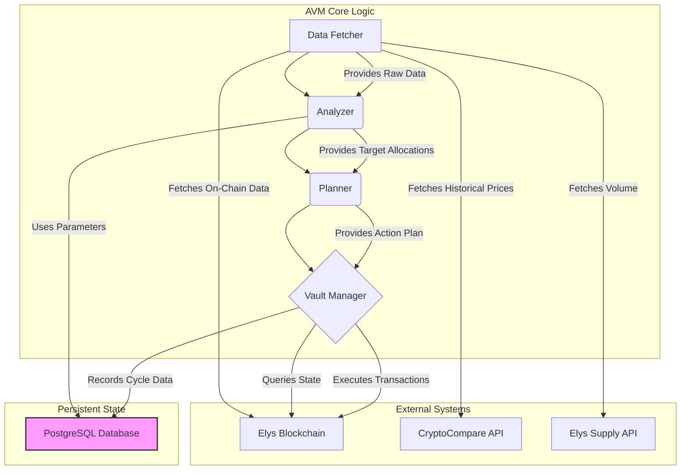

# High Yield LP Vault System Architecture

This document provides a high-level overview of the internal architecture of the High Yield LP Vault. It is intended for developers who want to understand the system's components, data flow, and design principles.

## Core Philosophy

The AVM is built on several key principles:

*   **Modularity & Separation of Concerns**: Each package has a distinct responsibility (e.g., fetching data, analyzing data, executing transactions). This makes the system easier to understand, test, and maintain.
*   **Safety First**: The system is designed to be fault-tolerant and risk-averse. This is achieved through rigorous data validation, on-chain simulations before execution, and strict slippage controls.
*   **Observability**: The AVM's actions must be transparent. Comprehensive logging, a real-time web dashboard, and detailed historical snapshots provide deep insight into its behavior.
*   **Adaptability**: The core strategy is defined by a set of `ScoringParameters` that are loaded from the database, allowing the strategy to be tuned and evolved without code changes.

## High-Level Data Flow

The High Yield LP Vault operates in a continuous cycle. The following diagram illustrates the flow of data between the core components during a single operational cycle.

## Component Breakdown

The project is organized into several key packages within the `internal/` directory.

### `cmd/avm`
The main entry point of the application. It is responsible for:
- Initializing all components (logger, database, gRPC client).
- Loading the active `ScoringParameters` from the database.
- Starting the main operational loop on a timer (`runAVMCycle`).
- Launching the web server.

### `internal/datafetcher`
The AVM's "senses." This package is responsible for gathering all raw data required for analysis from various sources.
- **`PoolRetriever.go`**: Fetches and assembles a complete picture of each liquidity pool from the `amm` and `masterchef` modules.
- **`Tokens.go`**: Fetches token metadata, current prices, and orchestrates the retrieval of historical data.
- **`HourlyPrice.go`**: Fetches 30 days of hourly price data from the CryptoCompare API, essential for volatility calculations.
- **`WeeklyVolumeByPool.go`**: Fetches 7-day trading volume from the Elys Supply Stats API.

### `internal/analyzer`
The AVM's "brain." It takes the raw data from the `datafetcher` and applies the AVM's core strategy to it.
- **`CalculateVolatility.go`**: Calculates annualized volatility for each token.
- **`CalculatePoolScore.go`**: Orchestrates the scoring of each pool based on the active `ScoringParameters`. It calculates reward, risk, liquidity, and bonus components to produce a final score.
- **`SelectTopPools.go`**: Sorts pools by score, selects the top candidates, and determines the final `targetAllocations` while enforcing min/max allocation constraints.

### `internal/planner`
The AVM's "strategist." It translates the high-level goal from the analyzer into a concrete, executable plan.
- **`planner.go`**: Takes the current vault positions and the `targetAllocations` and generates a sequence of `SubAction` structs. It intelligently creates a two-phase plan:
    1.  **Phase 1**: Withdraw from over-allocated pools and consolidate all resulting non-USDC assets into USDC via swaps.
    2.  **Phase 2**: Use the now-liquid USDC to perform single-sided deposits into under-allocated target pools.

### `internal/vault`
The AVM's "hands." This package provides a high-level interface (`VaultManager`) for interacting with the target vault.
- **`live.go`**: The live implementation of the `VaultManager` interface. It handles querying the vault's current state (positions, liquid USDC) and executing the `ActionPlan` generated by the planner.
- **`interface.go`**: Defines the `VaultManager` interface, allowing for mock implementations for testing.

### `internal/wallet`
The AVM's "signature." This package handles the low-level, security-critical details of creating, signing, and broadcasting transactions.
- **`client.go`**: A robust Cosmos SDK signing client that initializes the keyring and client context.
- **`transactions.go`**: Translates the planner's `SubAction` structs into specific SDK messages, embeds slippage protection, and manages the transaction lifecycle. A key feature is its use of gas simulation to ensure efficient and reliable transaction broadcasting.

### `internal/state`
The AVM's "memory." It manages all interactions with the PostgreSQL database.
- **`db.go`**: Handles the database connection and defines the schema for all tables.
- **`snapshot_store.go`**: Saves the detailed `CycleSnapshot` at the end of each cycle.
- **`parameters_store.go`**: Manages saving and loading different versions of the `ScoringParameters`.
- **`analytics.go`**: Provides functions to query historical data for the web dashboard.

### `internal/web`
Provides a real-time monitoring dashboard.
- **`server.go`**: A self-contained web server using `gorilla/mux` that exposes a REST API for querying cycle history and performance metrics. It serves a single-page HTML dashboard that consumes this API.

### `pkg/types`
This package defines all the shared data structures used across the entire application, ensuring consistency and type safety.

## The AVM Cycle in Detail

1.  **Start**: The `runAVMCycle` function is triggered by a timer.
2.  **Fetch**: The `datafetcher` gathers all necessary on-chain and off-chain data.
3.  **Assess**: The `vault` manager queries the current state of the vault (positions, value).
4.  **Analyze**: The `analyzer` takes the fetched data and current vault state, calculates volatility and IL risk, and produces a `finalScore` for each pool.
5.  **Select & Allocate**: The `analyzer` then selects the top-scoring pools and calculates the ideal `targetAllocations`.
6.  **Plan**: The `planner` compares the current allocations to the target allocations and generates a two-phase `ActionPlan` of `SubAction`s, complete with simulation data for slippage protection.
7.  **Execute**: The `vault` manager calls the `wallet` to execute the `ActionPlan`. The `wallet` builds the transactions, simulates for gas, signs, and broadcasts them.
8.  **Record**: After execution, the final state of the vault is queried. A `CycleSnapshot` is populated with the initial state, the plan, the final state, and calculated performance metrics (net return, slippage, gas costs).
9.  **Save**: The `state` manager saves the complete `CycleSnapshot` to the database.
10. **Repeat**: The AVM waits for the next timer tick.

## Future Improvements

-   **Parameter Optimization Loop**: Implement the logic to periodically analyze historical `CycleSnapshot` data and automatically tune the `ScoringParameters` to improve performance over time.